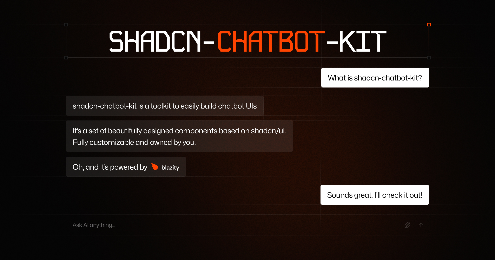

# shadcn-chatbot-kit

A comprehensive chatbot component kit built on top of and fully compatible with the [shadcn/ui](https://ui.shadcn.com/) ecosystem. Build beautiful, customizable AI chatbots in minutes while maintaining full control over your components.



[](https://choosealicense.com/licenses/mit/)
[](https://ui.shadcn.com)

## ✨ Features

- 🎨 **Fully Themeable**: Leverages shadcn/ui's theming system for complete visual customization
- 📦 **Copy & Paste Components**: Install only what you need, own your components
- 🔧 **Highly Customizable**: Modify any aspect of the components to match your needs
- 📱 **Responsive Design**: Works seamlessly across all device sizes
- 🚀 **Modern Code**: Built with the latest web standards and best practices

## 🧩 Components

The kit includes everything you need to build a full-featured chatbot:

- **Chat**: Pre-built chat component, with option to build a custom one with composable components
- **Auto-Scroll Message Area**: Smart scrolling behavior for new messages
- **Message Input**:
  - Auto-resize textarea
  - File upload support
  - Preview attached files
- **Prompt Suggestions**: Help users with quick action buttons
- **Message Actions**: Built-in copy, rate response, and other utility buttons
- **Loading States**: Elegant loading indicators and transitions

## 📦 Installation

1. First, follow the [installation instructions](https://ui.shadcn.com/docs/installation) for shadcn/ui in your project.

2. Make sure you're using the modern `shadcn` CLI (not the legacy `shadcn-ui`).

3. Install components using the CLI.

Visit [the documentation](https://shadcn-chatbot-kit.vercel.app/docs/components/chat) for detailed installation instructions and a full list of available components.

## 🚀 Quick Start

**Note:** This example uses the Vercel AI SDK. Follow the [official Getting Started guide](https://sdk.vercel.ai/docs/getting-started/nextjs-app-router#create-your-application), before using it.

```tsx
"use client"

import { useChat } from "ai/react"

import { Chat } from "@/components/ui/chat"

export function ChatDemo() {
  const { messages, input, handleInputChange, handleSubmit, isLoading, stop } =
    useChat()

  return (
    <Chat
      messages={messages}
      input={input}
      handleInputChange={handleInputChange}
      handleSubmit={handleSubmit}
      isGenerating={isLoading}
      stop={stop}
    />
  )
}
```

## 🎨 Customization

All components are built using shadcn/ui's styling system, making them fully customizable using CSS variables.
Visit our [theme customizer](https://shadcn-chatbot-kit.vercel.app/themes) to visually design your chatbot's appearance.

## 🤝 Contributing

Contributions are always welcome! Feel free to:

- Submit bug reports and feature requests
- Open pull requests to improve the codebase
- Share feedback and suggestions

## 👨‍⚖️ License

Licensed under the [MIT license](https://github.com/Blazity/shadcn-chatbot-kit/blob/main/LICENSE.md).
